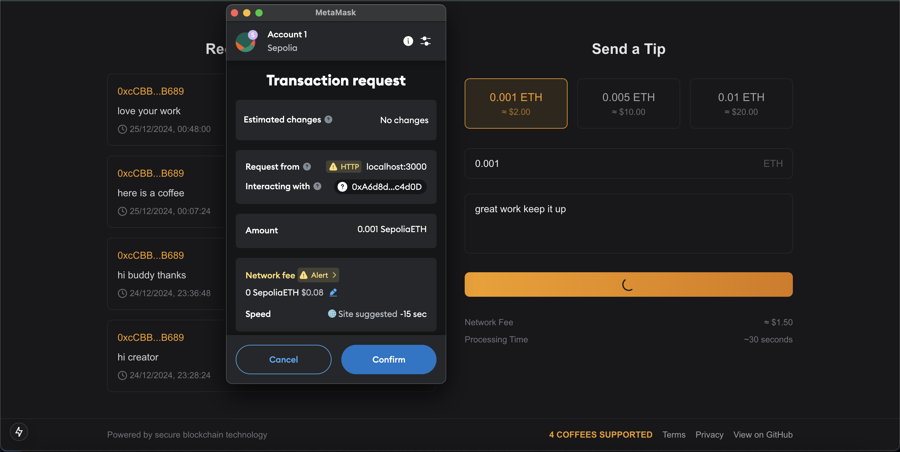

# Web3 Buy Me A Coffee

A decentralized "Buy Me a Coffee" application built using **Next.js**, **Thirdweb**,**Typescript**, **Tailwind CSS**, and blockchain technology. This app allows users to connect their wallets, interact with smart contracts, and make donations seamlessly.


## Features
- **Wallet Connection:** Connect your wallet to interact with the app.
- **Smart Contract Integration:** Powered by blockchain for secure and transparent transactions.
- **Donation System:** Send donations with messages.
- **Responsive UI:** Designed with Tailwind CSS for a seamless experience across devices.

## Tech Stack
- **Frontend:** Next.js, Typescript, thirdweb
- **Blockchain Integration:** Thirdweb, Solidity
- **UI Design:** Tailwind CSS

---

## Getting Started

### Prerequisites
Ensure you have the following installed:
- [Node.js](https://nodejs.org/) (v16 or higher)
- [Yarn](https://yarnpkg.com/) or [npm](https://www.npmjs.com/)
- A blockchain wallet like [MetaMask](https://metamask.io/)



### Installation

1. Clone the repository:
   ```bash
   git clone https://github.com/your-username/blockchain-coffee-app.git
   cd blockchain-coffee-app
   ```

2. Install dependencies:
   ```bash
   npm install
   # or
   yarn install
   ```

3. Configure environment variables:
   - Create a `.env.local` file in the root directory.
   - Add the following:
     ```env
     NEXT_PUBLIC_THIRDWEB_CLIENT_ID=your_thirdweb_api_key
     ```

4. Start the development server:
   ```bash
   npm run dev
   # or
   yarn dev
   ```

   The app will be available at [http://localhost:3000](http://localhost:3000).

### Smart Contract Deployment

1. Use [Thirdweb](https://thirdweb.com/) to create and deploy a smart contract.
2. Save the deployed contract address and API key for integration.

---


## Usage

1. Connect your wallet by clicking the **Connect Wallet** button.
2. Enter your donation message and amount.
3. Confirm the transaction in your wallet.
4. View the transaction history on the blockchain.

---

## Folder Structure
```plaintext
blockchain-coffee-app/
├── components/      # Reusable UI components
├── pages/           # Next.js pages
├── styles/          # Tailwind CSS styles
├── public/          # Static assets
├── utils/           # Helper functions
└── contracts/       # Smart contract ABIs (optional)
```

---

## Deployment

1. Build the application:
   ```bash
   npm run build
   # or
   yarn build
   ```

2. Deploy to platforms like [Vercel](https://vercel.com/) or [Netlify](https://www.netlify.com/).

---

## Contributing
Contributions are welcome! Feel free to fork the repository and submit a pull request.

---


